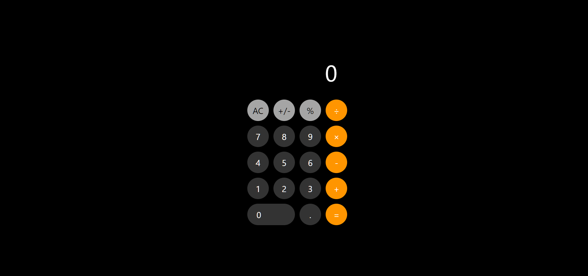

# 🧮 Calculadora - Estilo iPhone

Calculadora funcional desenvolvida com HTML, CSS e JavaScript puro, replicando o design e comportamento da calculadora do iOS.

## 📸 Preview


git
## ✨ Funcionalidades

- ➕ Operações básicas (adição, subtração, multiplicação, divisão)
- 🔄 Cálculos encadeados
- ➖ Inversão de sinal (+/-)
- 📊 Porcentagem (%)
- 🧹 Botão AC (All Clear)
- 🎨 Interface fiel ao design do iPhone
- ✅ Validação de entrada (ponto decimal único)
- 🚫 Prevenção de operadores repetidos

## 🛠️ Tecnologias Utilizadas

- HTML5
- CSS3 (Flexbox)
- JavaScript (ES6+)

## 🎯 Destaques Técnicos

- **Gerenciamento de estado** com variáveis de controle
- **Validações** para entrada de dados
- **Cálculos encadeados** (ex: 2 + 3 × 4)
- **Event delegation** com forEach
- **Conversão de tipos** (string ↔ number)
- **Switch statements** para operações
- **Arrow functions** para sintaxe moderna

## 🚀 Como Executar

1. Clone este repositório
```bash
git clone https://github.com/DanielMartins22/calculadora.git
```

2. Abra o arquivo `index.html` no navegador

Ou acesse a versão online: [GitHub Pages](https://DanielMartins22.github.io/calculadora)

## 📱 Design

Inspirado na calculadora nativa do iOS, com:
- Botões circulares
- Cores originais (cinza claro, cinza escuro, laranja)
- Botão zero expandido
- Fonte San Francisco (fallback: -apple-system)

## 👨‍💻 Autor

Desenvolvido por **Daniel Martins**

## 📄 Licença

Este projeto está sob a licença MIT.